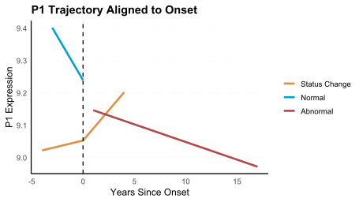
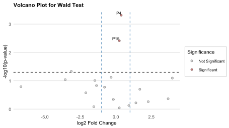
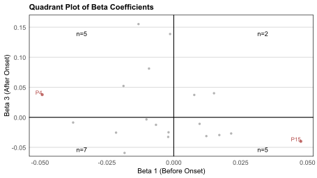
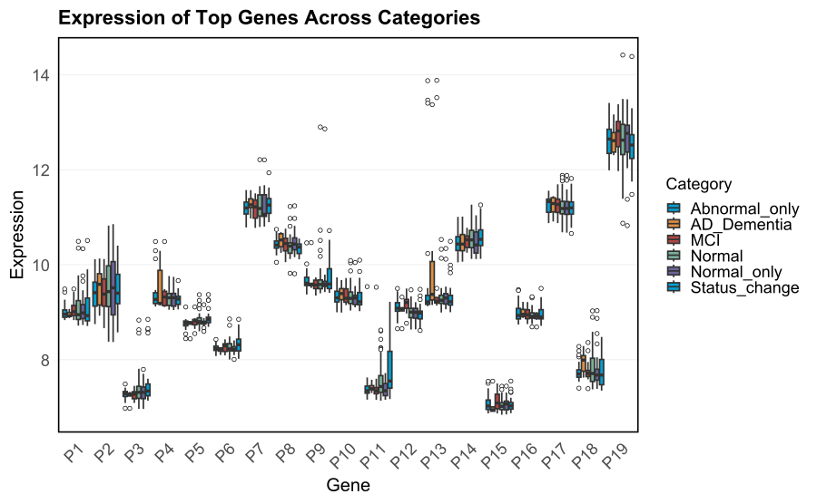
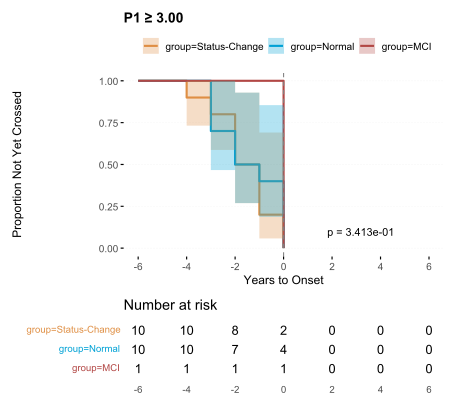

# CPLMM: Longitudinal Plasma Proteomics Analysis Package

**RPackage** is designed for **longitudinal plasma proteomics analysis**, with a special focus on modeling disease onset and progression (e.g., Alzheimer's disease). It integrates preprocessing, change-point mixed models, statistical tests, survival analysis, and publication-style visualization.

## Table of Contents

-   [Installation](#installation)
-   [Data Requirements](#data-requirements)
-   [Quick Start](#quick-start)
-   [Data Preprocessing](#data-preprocessing)
-   [Statistical Modeling](#statistical-modeling)
-   [Visualization](#visualization)
-   [Pathway Analysis](#pathway-analysis)
-   [Survival Analysis](#survival-analysis)
-   [Function Reference](#function-reference)

## Installation

``` r
# Install from GitHub 
devtools::install_github("xiaoqinghuanglab/CPLMM")
library(CPLMM)
```
If facing Issues You can download the tat.gz file from the zip folder then run this code
```r
install.packages("C:/path/CPLMM_0.0.0.9000.tar.gz", repos = NULL, type = "source")
```


## Data Requirements

### Input Data Structure

Most functions expect longitudinal data frames with the following columns:

-   `SUBID` – subject identifier
-   `PROCEDURE_AGE` – age at each visit
-   `ONSET_AGE` – disease onset age
-   `SEX` – biological sex (factor)
-   `BASELINE_AGE` – age at baseline visit
-   `CATEGORY` – diagnosis category (Normal, SCD, MCI, AD Dementia, FTD Dementia)
-   Protein columns – numeric expression values for 100s–1000s of proteins

### Required CSV Files

-   `df_all` - CSV file with all the data
-   `df_normal_only` - CSV file with normal only patients
-   `df_abnormal_only` - CSV file with abnormal only patients
-   `df_status_change` - CSV file with patients who converted from Normal to Abnormal

All the data frames must contain same numbers of proteins

## Quick Start

This Code shows how to get started with fitting the model for all the proteins/genes, visualize them and run Wald test on the results for a toy dataet

``` r
library(RPackage)

# Load your data
df_all <- read.csv("./data/df_all_toy.csv")
df_normal_only <- read.csv("./data/df_normal_only_toy.csv")
df_abnormal_only <- read.csv("./data/df_abnormal_only_toy.csv")
df_status_change <- read.csv("./data/df_status_change_toy.csv")
df_pathway <- read.csv("./data/toy_pathways.csv")

proteins <- colnames(df_normal_only)[9:27]

# Fit change-point linear mixed models across proteins
results <- fit_cplmm_all_proteins(
  df_status_change = df_status_change,
  df_normal = df_normal_only,
  df_abnormal = df_abnormal_only,
  protein_list = proteins,
  covariates = c("SEX", "BASELINE_AGE"),
  subject_id_col = "SUBID",                     
  years_since_onset_col = "years_since_onset"
)

# Visualize Individual Proteins
plot_cplmm(
  df_status_change, df_normal_only, df_abnormal_only,
  protein = "P1",                                     # protein/gene of inerest
  covariates = c("SEX","BASELINE_AGE"),
  subject_id_col = "SUBID",
  years_since_onset_col = "years_since_onset"
)

# Perform Wald test for significant slope changes
wald <- compute_wald_test(
  results_df = results,
  adjust_p = TRUE,
  rank_by = 1,                   # 1 to rank by Beta 1 and Beta 3; 2 to rank by Beta 2 and Beta 4
  alpha = 0.05                   # User defined threshold
)
```

## Statistical Modeling

### Change-Point Linear Mixed Models (CPLMM)

The `fit_cplmm_all_proteins()` function estimates slopes before and after onset for status-change subjects and single-slope models for normal-only/abnormal-only groups:

``` r
results <- fit_cplmm_all_proteins(
  df_status_change = df_status_change,
  df_normal = df_normal_only,
  df_abnormal = df_abnormal_only,
  protein_list = proteins,
  covariates = c("SEX","BASELINE_AGE"),
  subject_id_col = "SUBID",
  years_since_onset_col = "years_since_onset"
)
```

#### Result Columns:

-   **Beta 1, SE Beta 1** = pre-onset slope & SE (status-change)
-   **Beta 3, SE Beta 3** = post-onset slope & SE (status-change)
-   **Beta 2, SE Beta 2** = slope & SE in normal-only
-   **Beta 4, SE Beta 4** = slope & SE in abnormal-only
-   Model metrics (AIC, BIC, MSE) per group

### Wald Test

Find proteins with significant slope changes:

``` r
wald <- compute_wald_test(
  results_df = results,
  adjust_p = TRUE,    # BH FDR correction
  rank_by = 1,        # rank by P-value 1 (status-change pre vs post); enter 2 to rank by P-value 2 (noraml vs abnormal)
  alpha = 0.05        # User defined threshold
)
```

### Mann-Whitney U Test

Compare distributions within categories:

``` r
# Prepare combined expression data frame
expr_df <- prepare_combined_expression(
  df_normal_only = df_normal_only,
  df_status_change = df_status_change,
  df_abnormal_only = df_abnormal_only,
  df_all = df_all,
  subset_genes = proteins,
  category_col = "CATEGORY",
  categories = c("Normal","MCI","AD Dementia"),
  normal_label = "Normal_only",
  status_label = "Status_change",
  abnormal_label = "Abnormal_only"
)

# Perform Mann-Whitney U test
mw <- compare_groups_mannwhitney(
  combined_expr = expr_df,
  gene_list = c("P1","P2","P3"),
  group1 = "Normal_only",
  group2 = "MCI",
  alpha = 0.05,
  rank_by = "FDR"
)
```

## Visualization

### CPLMM Trajectory Plots

Visualize protein trajectories for proteins of interest:

``` r
plot_cplmm(
  df_status_change, df_normal_only, df_abnormal_only,
  protein = "P1",                                     # protein/gene of inerest
  covariates = c("SEX","BASELINE_AGE"),
  subject_id_col = "SUBID",
  years_since_onset_col = "years_since_onset"
)
```


### Volcano Plot

``` r
plot_wald_volcano(
  wald_df = wald,
  pval_col = "P-value 1",
  fdr_col = "Adjusted P-value 1",
  annotate = TRUE
)
```


### Quadrant Plot

``` r
plot_quadrant_beta(
  wald_df = wald,
  beta_x_col = "Beta 1",
  beta_y_col = "Beta 3",
  fdr_col = "Adjusted P-value 1",
  annotate = TRUE
)
```


### Expression Boxplots

``` r
plot_expression_boxplot(
  expr_df,
  gene_order = proteins,  # genes/proteins of interest
  hue_col = "Source",
  expression_col = "Expression",
  gene_col = "Gene"
)
```


## Pathway Analysis

### Data Requirements

Pathway analysis requires a data frame with the following columns:

-   `Pathway` - Pathway Names
-   `Gene` - Gene Enriched by the Pathway
-   `Source` - The tool used for enrichment (e.g., DAVID, Metascape)
-   `CategoryGroup` - Category of the Pathway provided by the tool
-   `LogQValues` - Log Q or Log P values of the pathways
-   `Cleaned Pathway` - Cleaned Pathway names for better readability
-   `Category` - Category Name to categorize the pathways (manually defined)

### Pathway Visualization

#### Bubble Plot

``` r
plot_pathway_bubble(
  df = df_pathway,
  pathway_col = "Cleaned_Pathway",
  category_col = "Category",
  source_col = "Source",
  logq_col = "LogQValue",
  gene_col = "Gene",
  title = "Pathway Enrichment by Source",
  size_scale = 15  # maximum bubble size
)
```


#### Heatmap

``` r
plot_pathway_gene_heatmap(
  df = df_pathway,
  pathway_col = "Cleaned_Pathway",
  category_col = "Category",
  gene_col = "Gene",
  title = "Pathway–Gene Membership Heatmap"
)
```


#### Top Pathways Bar Plot

``` r
plot_top_pathways_bar(
  df = df_pathway,
  pathway_col = "Cleaned_Pathway",
  gene_col = "Gene",
  logq_col = "LogQValue",         # logq (or logp) column
  category_col = "Category",
  top_n = 6,                      # number of pathways in the plot
  annotate = TRUE                 # annotate with logq (or logp) values if available
)
```


## Survival Analysis

Compute time-to-threshold events per subject and plot Kaplan-Meier curves:

``` r
plot_km_with_threshold(
  biomarker_name = "P1",    # protein of choice
  threshold = 3,           # user defined threshold value
  wd_df = df_status_change,           # Status change data
  normal_df = df_normal_only,    # Normal only data
  abnm_df = df_abnormal_only,       # Abnormal only data
  time_points = seq(-6, 6, by = 2)  # user defined timepoints for x-axis for better visualization
)
```


## Data Preprocessing

These functions can be used to get `years_since_onset`, setting onset age for normal patients, correcting onset age and status to make a unidirectional flow and to separate status change patients from the data. It is not an requirement to run these function when using the toy dataset as the required columns are alredy present in the dataset.

### Calculate Years Since Onset

Compute time relative to onset: age - onset_age

``` r
calculate_years_since_onset(
  df, 
  age_col = "age", 
  onset_age_col = "onset_age", 
  new_col = "years_since_onset"
)
```

### Set Onset Age For Normal Subjects

For subjects always Normal, set onset to their max observed age (so all timepoints are pre-onset):

``` r
set_onset_age_for_normals(
  df,
  subject_id_col = "SUBID", 
  status_col = "status_raw",
  age_col = "age", 
  mutated_col = "DECAGE"
)
```

### Correct Status by Onset

Fix label inconsistencies relative to onset (post-onset "Normal" → "Abnormal", etc.):

``` r
correct_status_by_onset(
  df, 
  age_col = "AGE", 
  onset_age_col = "onset_age", 
  status_col = "status_cleaned"
)
```

### Enforce Unidirectional Status Change

"Once Abnormal, always Abnormal" (applies forward in time per subject):

``` r
enforce_unidirectional_status_change(
  df,
  subject_id_col = "SUBID", 
  status_col = "status_cleaned", 
  date_col = "procedure_date"
)
```

### Identify Status Change Patients

Keep only subjects who change from Normal → Abnormal:

``` r
identify_status_change_subjects(
  df,
  subject_id_col = "SUBID",
  status_col = "status_cleaned",
  date_col = "procedure_date"
)
```

## Function Reference {#function-reference}

### Data Requirements by Function Type

-   **Longitudinal frames** (df_status_change, df_normal_only, df_abnormal_only):
    -   Columns: SUBID, years_since_onset, covariates (e.g., SEX, BASELINE_AGE), and protein columns (numeric)
    -   Optional: PROCEDURE_AGE, ONSET_AGE if you need to compute years_since_onset
-   **CPLMM results** for Wald (results):
    -   Columns: Protein, Beta 1, SE Beta 1, Beta 3, SE Beta 3, Beta 2, SE Beta 2, Beta 4, SE Beta 4
-   **Expression long table** (expr_df):
    -   Columns: Gene, Expression, Source
-   **Pathway table** (path_df):
    -   Columns: Cleaned_Pathway, BioCategory_Manual, Source, LogQValue, Gene

### Help Documentation

For detailed function documentation, use:

``` r
?fit_cplmm_all_proteins
?plot_wald_volcano
?compute_wald_test
# ... and other function names
```

## License

[Add your license information here]

## Citation

[Add citation information here]

## Contributing

[Add contributing guidelines here]

## Contact

[Add contact information here]


