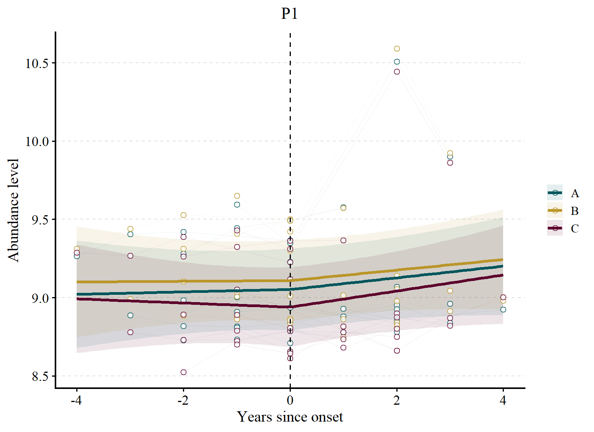
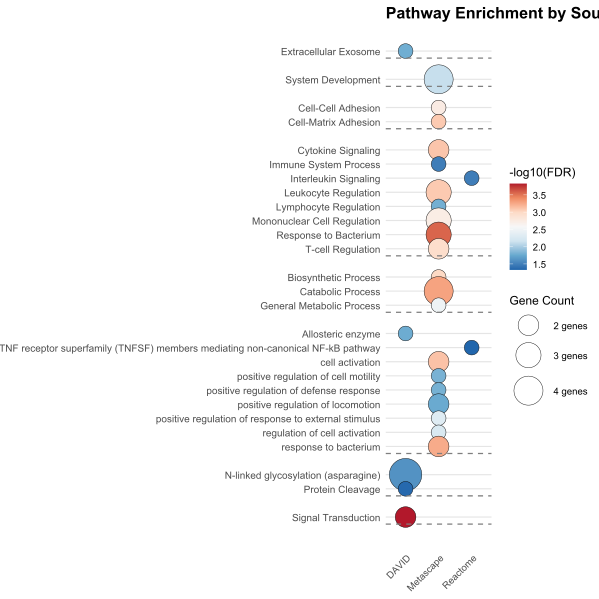
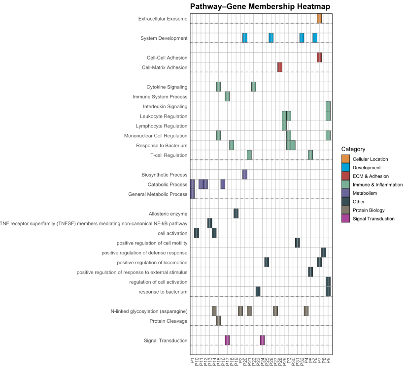
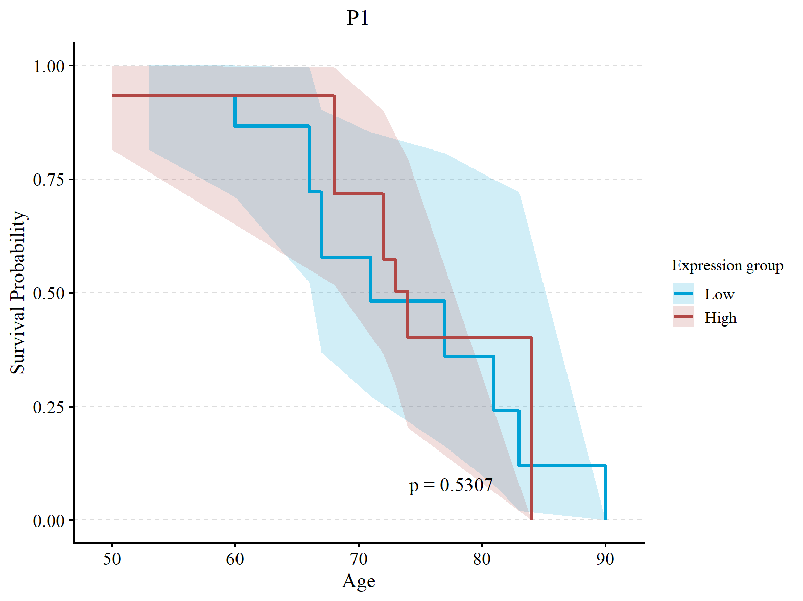
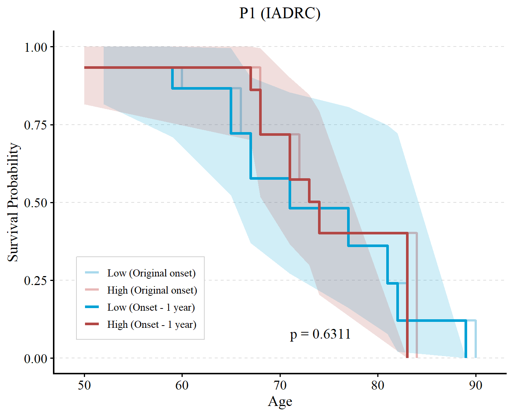

# CPMM: Longitudinal Plasma Proteomics Analysis Package

**CPMM** is designed for longitudinal plasma proteomics analysis, with a focus on modeling protein trajectories around disease onset and evaluating reproducible onset-associated changes across cohorts. The package includes preprocessing utilities, change-point mixed models, random-effects meta-analysis, survival analysis, pathway visualization, and publication-style plotting functions.

## Table of Contents

- [Installation](#installation)
- [Data Requirements](#data-requirements)
- [Quick Start](#quick-start)
- [Statistical Modeling](#statistical-modeling)
- [Visualization](#visualization)
- [Pathway Analysis](#pathway-analysis)
- [Survival Analysis](#survival-analysis)
- [Function Reference](#function-reference)

## Installation

```r
# Install from GitHub
devtools::install_github("xiaoqinghuanglab/CPMM")
library(CPMM)
```

The package can also be installed from a local source archive:

```r
install.packages("path/to/CPMM_0.0.0.9000.tar.gz", repos = NULL, type = "source")
library(CPMM)
```

Installing through the RStudio GUI:

1. Go to **Tools → Install Packages**.
2. Set **Install from** to **Package Archive File (.zip, .tar.gz)**.
3. Select the local `.tar.gz` file.
4. Click **Install**.

## Data Requirements

Most functions expect longitudinal data frames with one row per subject visit. The core columns are:

- `SUBID` – subject identifier
- `PROCEDURE_AGE` – age at each visit
- `ONSET_AGE` – disease onset age
- `years_since_onset` – visit age minus onset age
- `SEX` – biological sex or encoded sex variable
- `BASELINE_AGE` – age at the first observed visit
- `CATEGORY` – diagnosis category, when applicable
- Protein columns – numeric protein abundance values

For survival sensitivity analyses, users may provide an alternative onset column, such as:

- `ONSET_AGE_minus` – onset age shifted earlier by one year

### Example Input Files

A typical analysis may use:

- `df_all` – all longitudinal observations
- `df_cu` – subjects who remain cognitively unimpaired or normal
- `df_ci` – subjects abnormal at baseline or throughout follow-up
- `df_conv` – subjects who convert from normal to abnormal

For multi-cohort CPMM plotting and meta-analysis, each cohort should have the same protein identifiers for the proteins being analyzed.

## Quick Start

```r
library(CPMM)

# Load toy data for three cohorts
df_cu_1 <- read.csv("./data/df_cu_toy.csv")
df_ci_1 <- read.csv("./data/df_ci_toy.csv")
df_conv_1 <- read.csv("./data/df_conv_toy.csv")

df_cu_2 <- read.csv("./data/df_cu_toy_cohort2.csv")
df_ci_2 <- read.csv("./data/df_ci_toy_cohort2.csv")
df_conv_2 <- read.csv("./data/df_conv_toy_cohort2.csv")

df_cu_3 <- read.csv("./data/df_cu_toy_cohort3.csv")
df_ci_3 <- read.csv("./data/df_ci_toy_cohort3.csv")
df_conv_3 <- read.csv("./data/df_conv_toy_cohort3.csv")

# Select protein columns
proteins <- paste0("P", 1:6)

# Fit CPMM separately in each cohort
results_1 <- fit_cpmm_all_proteins(
  df_conv = df_conv_1,
  protein_list = proteins,
  covariates = c("SEX", "BASELINE_AGE"),
  subject_id_col = "SUBID",
  years_since_onset_col = "years_since_onset"
)

results_2 <- fit_cpmm_all_proteins(
  df_conv = df_conv_2,
  protein_list = proteins,
  covariates = c("SEX", "BASELINE_AGE"),
  subject_id_col = "SUBID",
  years_since_onset_col = "years_since_onset"
)

results_3 <- fit_cpmm_all_proteins(
  df_conv = df_conv_3,
  protein_list = proteins,
  covariates = c("SEX", "BASELINE_AGE"),
  subject_id_col = "SUBID",
  years_since_onset_col = "years_since_onset"
)

# Add cohort labels and combine results for meta-analysis
results_1$Cohort <- "Cohort_1"
results_2$Cohort <- "Cohort_2"
results_3$Cohort <- "Cohort_3"

all_cohort_results <- rbind(results_1, results_2, results_3)

meta_results <- run_cpmm_meta_analysis(
  all_cohort_results_df = all_cohort_results,
  protein_col = "Protein",
  delta_col = "Delta",
  se_delta_col = "SE Delta",
  min_cohorts = 3
)

# Plot CPMM trajectories across cohorts
plot_cpmm(
  cohort_dfs = list(
    Cohort_1 = df_conv_1,
    Cohort_2 = df_conv_2,
    Cohort_3 = df_conv_3
  ),
  protein = "P1",
  covariates = c("SEX", "BASELINE_AGE"),
  subject_id_col = "SUBID",
  years_since_onset_col = "years_since_onset"
)

# Build age-based survival data for one protein
surv_df <- make_expression_survival_df(
  cu = df_cu_1,
  ci = df_ci_1,
  conv = df_conv_1,
  protein = "P1",
  subject_col = "SUBID",
  age_col = "PROCEDURE_AGE",
  onset_col = "ONSET_AGE",
  expr_group_method = "median",
  include_ci = TRUE,
  ci_event_time = "baseline"
)

plot_expression_km(
  surv_df = surv_df,
  protein_name = "P1"
)
```

## Statistical Modeling

### Change-Point Mixed Models

The `fit_cpmm_all_proteins()` function fits one random-intercept change-point mixed model per protein among status-change subjects:

```r
protein ~ before_onset + after_onset + covariates + (1 | subject_id)
```

The change point is fixed at onset, where `years_since_onset = 0`.

```r
results <- fit_cpmm_all_proteins(
  df_conv = df_conv_1,
  protein_list = proteins,
  covariates = c("SEX", "BASELINE_AGE"),
  subject_id_col = "SUBID",
  years_since_onset_col = "years_since_onset"
)
```

#### Main Output Columns

- `Protein` – protein identifier
- `Beta 1`, `SE Beta 1` – interpretable pre-onset slope and standard error
- `Beta 2`, `SE Beta 2` – post-onset slope and standard error
- `Beta Before Raw`, `Beta After Raw` – raw model coefficients
- `Var Before Raw`, `Var After Raw`, `Cov Before After` – variance-covariance terms
- `Delta` – slope-change contrast, calculated as `Beta 2 - Beta 1`
- `SE Delta` – standard error of `Delta`
- `Delta 95% CI Lower`, `Delta 95% CI Upper` – confidence interval for `Delta`
- `Intercept`, `AIC`, `BIC`, `MSE`, `N Obs` – model summary metrics

### Random-Effects Meta-Analysis

The `run_cpmm_meta_analysis()` function pools cohort-specific CPMM slope-change estimates across cohorts. The input should contain one row per protein per cohort and include `Protein`, `Delta`, and `SE Delta`.

```r
meta_results <- run_cpmm_meta_analysis(
  all_cohort_results_df = all_cohort_results,
  protein_col = "Protein",
  delta_col = "Delta",
  se_delta_col = "SE Delta",
  min_cohorts = 3,
  fdr_method = "BH",
  alpha = 0.05
)
```

#### Meta-Analysis Output Columns

- `Protein`
- `N Cohorts`
- `Meta Delta`
- `Meta SE`
- `Meta 95% CI Lower`
- `Meta 95% CI Upper`
- `Meta Z`
- `Meta P-value`
- `Q`, `df`, `Tau^2`, `I^2`
- `Meta Adjusted P-value (FDR)`
- `Meta Significant`

## Visualization

### CPMM Trajectory Plot

The `plot_cpmm()` function overlays CPMM trajectories across one or more cohorts. It accepts a named list of cohort data frames, which makes it suitable for single-cohort and multi-cohort analyses.

```r
plot_cpmm(
  cohort_dfs = list(
    A = df_conv_1,
    B = df_conv_2,
    C = df_conv_3
  ),
  protein = "P1",
  covariates = c("SEX", "BASELINE_AGE"),
  subject_id_col = "SUBID",
  years_since_onset_col = "years_since_onset",
  cohort_colors = c(
    A = "#00565c",
    B = "#ba9629",
    C = "#5c002c"
)

```



## Pathway Analysis

### Data Requirements

Pathway analysis functions expect a pathway-level data frame with pathway labels, genes/proteins, enrichment source, category labels, and enrichment statistics.

Common columns include:

- `Pathway` or `Cleaned_Pathway` – pathway name
- `Gene` – protein or gene mapped to the pathway
- `Source` – enrichment source, such as DAVID, Reactome, or Metascape
- `Category` – manually assigned pathway category
- `LogQValue` – transformed enrichment significance value

Load the toy pathways file to see the example visualization

### Pathway Bubble Plot

```r
plot_pathway_bubble(
  df = df_pathway,
  pathway_col = "Cleaned_Pathway",
  category_col = "Category",
  source_col = "Source",
  logq_col = "LogQValue",
  gene_col = "Gene",
  title = "Pathway Enrichment by Source",
  size_scale = 15
)
```



### Pathway-Gene Heatmap

```r
plot_pathway_gene_heatmap(
  df = df_pathway,
  pathway_col = "Cleaned_Pathway",
  category_col = "Category",
  gene_col = "Gene",
  title = "Pathway-Gene Membership Heatmap"
)
```



## Survival Analysis

The survival workflow uses baseline protein abundance to define High and Low expression groups and evaluates time to diagnosis/conversion using **age** as the survival time axis.

### Build Survival Data

```r
surv_df <- make_expression_survival_df(
  cu = df_cu_1,
  ci = df_ci_1,
  conv = df_conv_1,
  protein = "P1",
  subject_col = "SUBID",
  age_col = "PROCEDURE_AGE",
  onset_col = "ONSET_AGE",
  expr_group_method = "median",
  include_ci = TRUE,
  ci_event_time = "baseline"
)
```

The returned data frame contains one row per subject, with:

- `SUBID`
- `source_group`
- `baseline_age`
- `end_age`
- `onset_age`
- `baseline_expr`
- `event`
- `expr_group`
- `cutoff`
- `Protein`
- `age_time`

### Kaplan-Meier Plot

```r
plot_expression_km(
  surv_df = surv_df,
  protein_name = "P1"
)
```



### Early-Onset Sensitivity Analysis

For an onset-minus-one-year analysis, first create or provide an onset-shifted column, such as `ONSET_AGE_minus`. Then build a second survival data frame and overlay it against the original onset analysis.

```r
surv_df_original <- make_expression_survival_df(
  cu = df_cu_1,
  ci = df_ci_1,
  conv = df_conv_1,
  protein = "P1",
  onset_col = "ONSET_AGE",
  include_ci = TRUE,
  ci_event_time = "baseline"
)
```
Create the ONSET_AGE_minus column if not already in the data

```r
surv_df_minus1 <- make_expression_survival_df(
  cu = df_cu_1,
  ci = df_ci_1,
  conv = df_conv_1,
  protein = "P1",
  onset_col = "ONSET_AGE_minus",
  include_ci = TRUE,
  ci_event_time = "onset"
)

plot_expression_km_onset_overlay(
  surv_df_main = surv_df_minus1,
  surv_df_bg = surv_df_original,
  protein_name = "P1",
  main_label = "Onset - 1 year",
  bg_label = "Original onset",
  cohort_label = "Cohort 1"
)
```

The overlay plot displays the original onset curves in lighter colors and the onset-minus-one-year curves in darker colors.



## Function Reference {#function-reference}

### Main Functions

- `fit_cpmm_all_proteins()` – fit CPMM across proteins in status-change subjects
- `run_cpmm_meta_analysis()` – pool cohort-specific CPMM `Delta` estimates using random-effects meta-analysis
- `plot_cpmm()` – plot CPMM trajectories across one or more cohorts
- `make_expression_survival_df()` – build subject-level survival data using baseline expression groups and age time
- `plot_expression_km()` – plot age-based Kaplan-Meier curves for High versus Low expression groups
- `plot_expression_km_onset_overlay()` – overlay original-onset and onset-minus-one-year KM curves
- `plot_pathway_bubble()` – pathway enrichment bubble plot
- `plot_pathway_gene_heatmap()` – pathway-gene heatmap

### Data Requirements by Function Type

- **CPMM input frames**:
  - `SUBID`, `years_since_onset`, covariates such as `SEX` and `BASELINE_AGE`, and numeric protein columns
- **CPMM meta-analysis input**:
  - `Protein`, `Delta`, `SE Delta`, and optionally `Cohort`
- **Survival input frames**:
  - `SUBID`, `PROCEDURE_AGE`, `ONSET_AGE` or an alternative onset column, and numeric protein columns
- **Expression long table**:
  - `Gene`, `Expression`, `Source`
- **Pathway table**:
  - pathway name, category, source, enrichment statistic, and gene/protein columns

### Help Documentation

For detailed function documentation, use:

```r
?fit_cpmm_all_proteins
?run_cpmm_meta_analysis
?plot_cpmm
?make_expression_survival_df
?plot_expression_km
?plot_expression_km_onset_overlay
```
